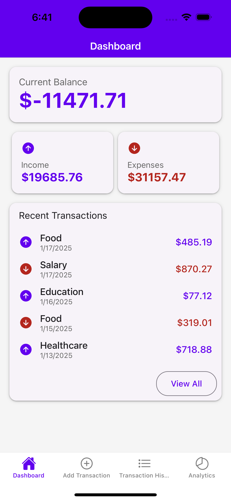
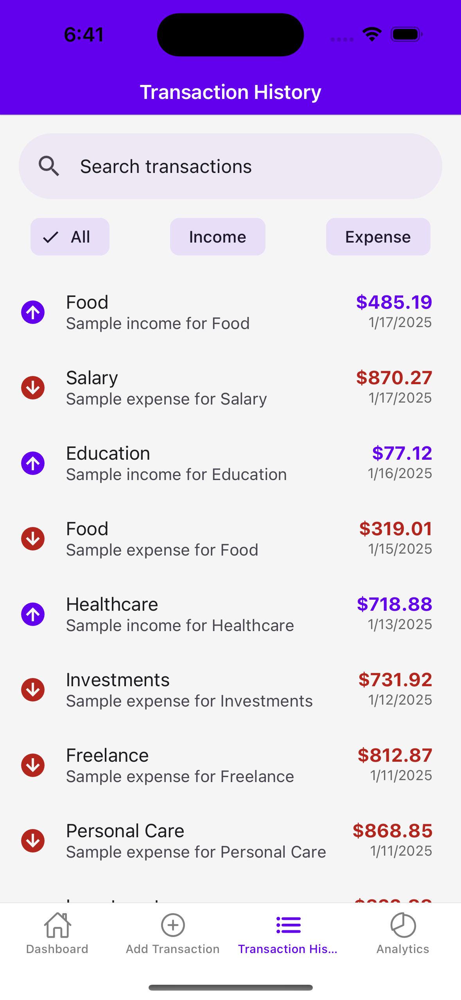
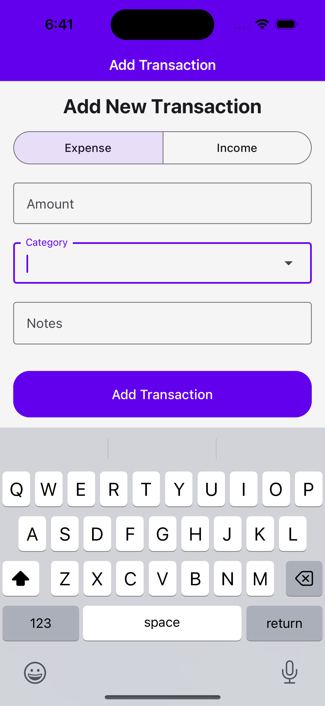
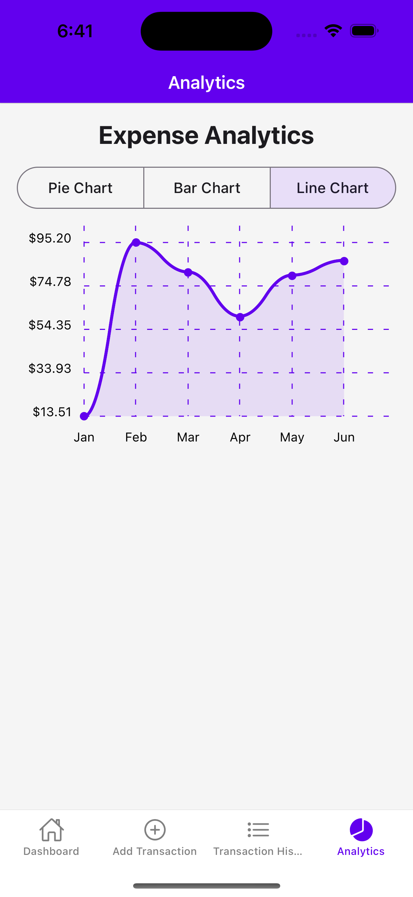
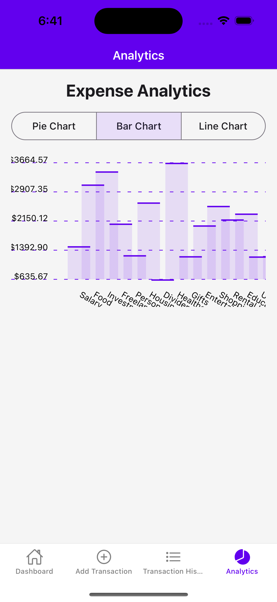

# Offline Finance Tracker

## Overview

The **Offline Finance Tracker** is a mobile application that enables users to track their income and expenses effortlessly, even without an internet connection. It provides comprehensive features like categorization, transaction history, charts, and offline data synchronization.

---

## Requirements

### Functional Requirements

- **Add Transactions**: Users can log income or expense transactions.
- **Categorize Transactions**: Organize transactions into categories (e.g., Food, Rent, Travel).
- **View Transaction History**: Display past transactions with detailed information.
- **Graphs and Charts**: Visualize financial trends using:
  - **Pie charts** for expense breakdown.
  - **Bar graphs** for income vs. expenses over time.
  - **Line charts** for tracking monthly expenses.
- **Search and Filter**: Search and filter transactions by date, category, or amount.
- **Offline Access**: All features available offline.
- **Data Sync**: Sync transactions with a remote server when online.
- **Notifications**: Alerts for successful or failed sync operations.

### Non-Functional Requirements

- **Performance**: Ensure quick access to local data, even for large datasets.
- **Data Security**: Encrypt sensitive data stored locally.
- **Scalability**: Support increasing numbers of transactions.
- **Cross-Platform**: Seamless operation on both iOS and Android.
- **User-Friendly Interface**: Simplified UI for adding, editing, and visualizing transactions.

## Screenshots

## Dashboard



## Transactions



## Add Transaction



## Analytics





# Firebase Configuration Setup

## Instructions

### 1. Obtain Firebase Configuration

- Go to the [Firebase Console](https://console.firebase.google.com/).
- Select your Firebase project.
- Navigate to **Project Settings** > **General** tab.
- Scroll down to the "Your apps" section.
- Click on your app (or add a new one) to see the Firebase configuration details.
- Copy the following values:
  - `apiKey`
  - `authDomain`
  - `projectId`
  - `storageBucket`
  - `messagingSenderId`
  - `appId`

### 2. Copy the Sample `.env` File

- Locate the `.env.sample` file in the root of the project.
- Copy the file and rename it to `.env`:
  ```bash
  cp .env.sample .env
  ```
